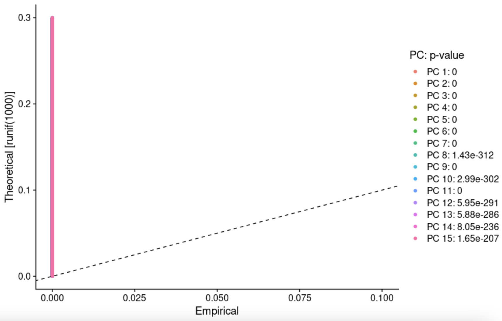

## NRI Group Update 1

## Team Information

**Members:**
- Sara Mandic
- Jake Stenger
- Nancy Zha

**Sponsor:**
- Stella Glasauer

**Mentor:**
- Megan Elcheikhali

**Research Lab:**
- Neuroscience Research Institute 

## Additional Background:
- TODO: Fill in  

## Inital Efforts: 
- TODO: Fill in 

## Current Work:
- Primarily we took our data and used a violin plot to filter cells with unique features counts over 2,500 or less than 200. In addition we filtered cells that had >5% mitochondrial counts. 

- We continued our work by looking at feature-feature relationships within our data. 

- Afterwards, we normalized the data and then used the normalized data to identify highly varaible fatures. These features are ones that exhibit high cell-to-cell variation (they are highly expressed in some cells and lowly expressed in others)

- Next we scaled the data and performed PCA on our data. The plots below show different ways of visualizing both cells and features that define the PCA. 

- To overcome the techincal noise from single feature RNA sequencing data it is necessary to determine the top principal components in order to represent a robust compression of the dataset. So, we used Jack Straw plots and Elbow plots to achieve this. Primarily we used a Jack Straw plot to compare the distribution of p-values for each PC with a uniform distribution. Significant PCs show a strong enrichment of features with low p-values (solid curve above the dashed line). 

- We also worked with the Elbow plot which ranks the principle components based on the percentage of variance explained by each one. This is shown below.

## Future Goals: 
- TODO: Fill in 
