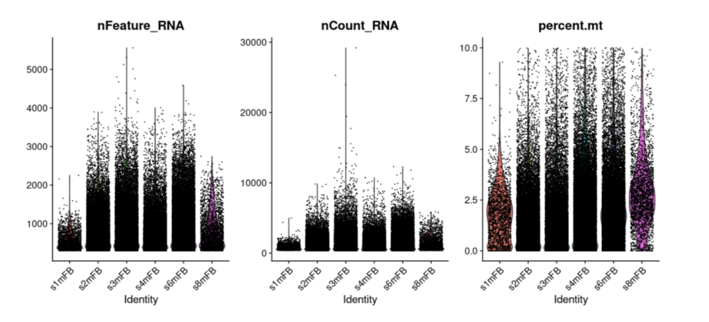
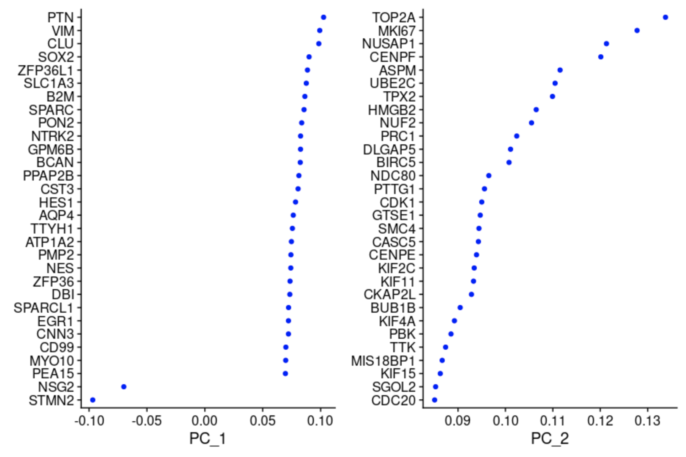
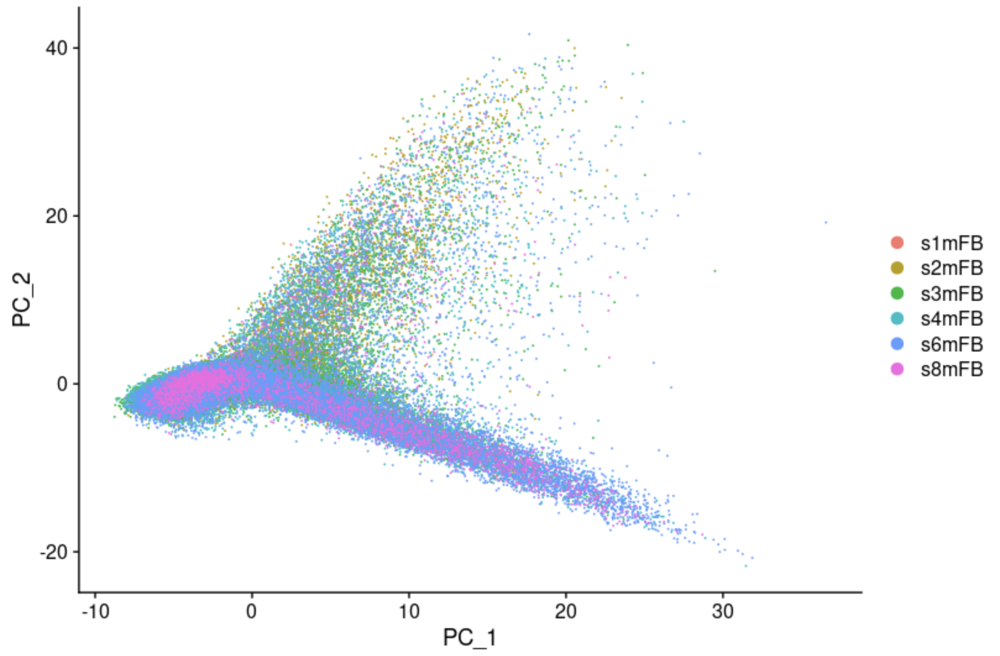
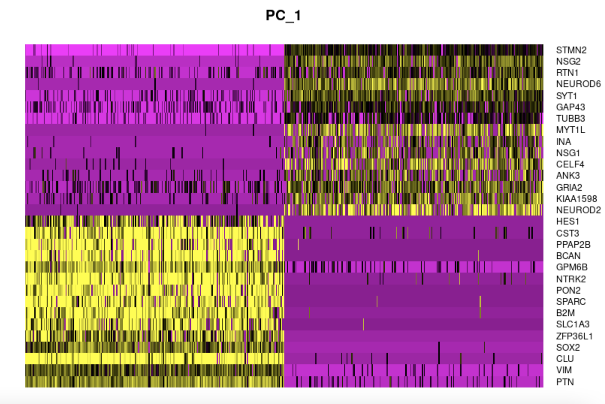

## Team Information

**Members:**
- Sara Mandic
- Jake Stenger
- Nancy Zha

**Sponsor:**
- Stella Glasauer

**Mentor:**
- Megan Elcheikhali

**Research Lab:**
- Neuroscience Research Institute 

## Background:
A short refresher on our project and goals: NRI is using brain organoids, which are living 3D cell blobs, to study causes of neurodegeneration. They are generated from stem cells which were sampled from patients with mutations associated with neurodegenerative diseases, and also from control cell lines where the mutation is edited out. The data spans across several different mutations and brain organoid ages. Single-cell sequencing is used, which counts the expression of known mRNA sequences within each individual cell of an organoid. Our dataset consists of about 22 thousand features (gene expression counts) for ~ 76 thousand cells. We are using R with packages built specifically for single-cell and gene analysis.

## Inital Efforts: 
- Our first step was to preprocess the data. Some preliminary quality control steps were already taken: filtering out cells with extremely high or low total gene counts, or very high proportions of mitochontria-associated genes (an indicator of dead cells).

- Normalization is a necessary step before analysis because there is high variation in the raw gene counts introduced by the process of measurement: two identical cells could produce very similar gene counts per million, but one could have double the total counts  (sequencing depths). We tried both simple log-normalization and SC-transform:

    - Simple log-normalization assumes every cell should have the same total amount of gene expression, scales accordingly, and log-transforms the result
    - SC (single cell) transform is a more statistically complex method: it models the effect of sequencing depth on the expression level of each individual gene with a generalized linear model, and regresses it out. Not just the sequencing depth can be regressed out: any independent technical covariates (like experiment batch) can be regressed out 

- Reducing the computational complexity is necessary for clustering given the size of our dataset. We calculate the standardized variance across cells and select the most variable genes. The number of genes to include is another parameter that affects clustering. 

- To deal with the curse of dimensionality, we used principal component analysis. A tough question is how many components to use in downstream analysis: we plotted heatmaps to visualize how gene expression varies between cells on the extreme ends of each compenent. We also plotted the standard deviation of each PC. Along with these heuristics and advice from literature, we also used some brute force iteration to see how clustering was affected.

- Clustering: we don't know exactly how many cell types are present in the data, so a flexible clustering algorithm is needed. Seurat implements the Louvain algorithm, which generates a graph that connects points close in the PCA space and and also connects each point to its neighbors' neighbors. Then highly connected neighborhoods are chosen as clusters. This algorithm has parameters that affect cluster sizes.

- Visualization: to evaluate clustering, we need to capture more than just two PCA dimensions visually. For this, a non-linear method is needed that captures both global and local features. We used UMAP which is popular for this task. Using this visualization we can gauge whether the clustering is too wide (not enough clusters) or too narrow (too many clusters).

- Differential expression: Using a statistical test, we determine which genes stand out in each cluster compared to all the cells. So far we've been using the Wilcoxon test (non-parametric, similar to Student's-t test)

- 

## Current Work:
- Primarily we took our data and used a violin plot to filter cells with unique features counts over 2,500 or less than 200. In addition we filtered cells that had >5% mitochondrial counts. 

- We continued our work by looking at feature-feature relationships within our data. 

- Afterwards, we normalized the data and then used the normalized data to identify highly varaible fatures. These features are ones that exhibit high cell-to-cell variation (they are highly expressed in some cells and lowly expressed in others)

- Next we scaled the data and performed PCA on our data. The plots below show different ways of visualizing both cells and features that define the PCA. 

- To overcome the techincal noise from single feature RNA sequencing data it is necessary to determine the top principal components in order to represent a robust compression of the dataset. We worked with the Elbow plot which ranks the principle components based on the percentage of variance explained by each one. This is shown below.

- Finally we used UMAP to construct a high dimensional graph representation of the data then optimizes a low-dimension graph to be as structrually similar as possible. The goal of this algorithms is to learn the underlying manifold of the data in order to place similar cells together in low-dimensional space. 

## Future Goals: 
- Future goals:

Preprocessing Steps: 
SCTransform is a widely used method for normalization and it removes the influence of technical effects like batch effect and variation of sequencing depth. We will use one SCTransform step to replace Normalization, Feature Selection, and Scaling steps. Then we will compare the transformed results and their UMAP clustering performance with those generated by the Log-Normalization method and decide which one to use.

Downstream Analysis: 
After all the preprocessing steps, we will focus on downstream analysis, connecting data with prior biological knowledge like genome annotation information with the help of existing databases, and making biological interpretations of our data in the future. The downstream analysis will be divided into cell and gene approaches. With the cell level approach, we will annotate and analyze clusters to infer the identity of cells. 

With the gene approach, since it is not intuitive and appropriate to directly compare the obtained huge number of differential genes, we need to annotate these differential genes and group them into several categories. After that, we will compare the similarities and differences of the grouped categories for functional or compositional analysis. On a gene level, we will use the website Metascape and a R package called topGO to perform gene set enrichment analysis and build gene regulatory networks. Enrichment tests show whether a list of genes are significantly enriched in a certain type of category that is annotated in existing databases and help to infer the biological meaning of differentially expressed genes between samples. 
   
   - [Metascape](https://metascape.org/gp/index.html#/main/step1): A web-based tool that analyzes and visualizes enrichment of gene lists. 
   
   - [topGO](https://bioconductor.org/packages/release/bioc/html/topGO.html): A R package designed for gene set enrichment analysis for Gene Ontology terms. It computes gene enrichment using two statistical tests: Kolmogorov-Smirnov test based on gene scores(differential expression level) and Fisher’s exact test based on gene counts. 

